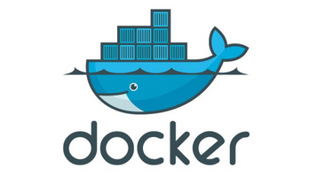

# Simple Docker training examples
## Let's try Docker engine

```bash
#Let's check that your local Docker repository is empty
docker images
```
```bash
#Download this image into your local repository
docker pull kitematic/hello-world-nginx
```
```bash
#You should now be able to see it
docker images
```

```bash
#Check that no container is running
docker ps
```

```bash
#Start a container with your new docker image
docker run -p 80:80 -d kitematic/hello-world-nginx
```

```bash
#You should now be able to see it running
docker ps
```

Use your browser to go to http://localhost

```bash
#Stop the running container
docker stop hello-world
```

```bash
#And check that no container is running
docker ps
```
```bash
#To show dead containers, use "-a"
docker ps -a
```

```bash
#Delete the dead container
docker rm hello-world
```

```bash
#Delete the container image
docker rmi kitematic/hello-world-nginx
```


## Debugging tips

Is my container working ?
```bash
docker ps
```
Are there any errors ?
```bash
docker logs <container_name>
```
How do I check deeper?
```bash
docker exec -ti <container_name> bash
```

Where can I get a new Docker image or some help with mine?
Try the Docker hub ! http://hub.docker.com

Where is the Docker documentation? https://docs.docker.com/
